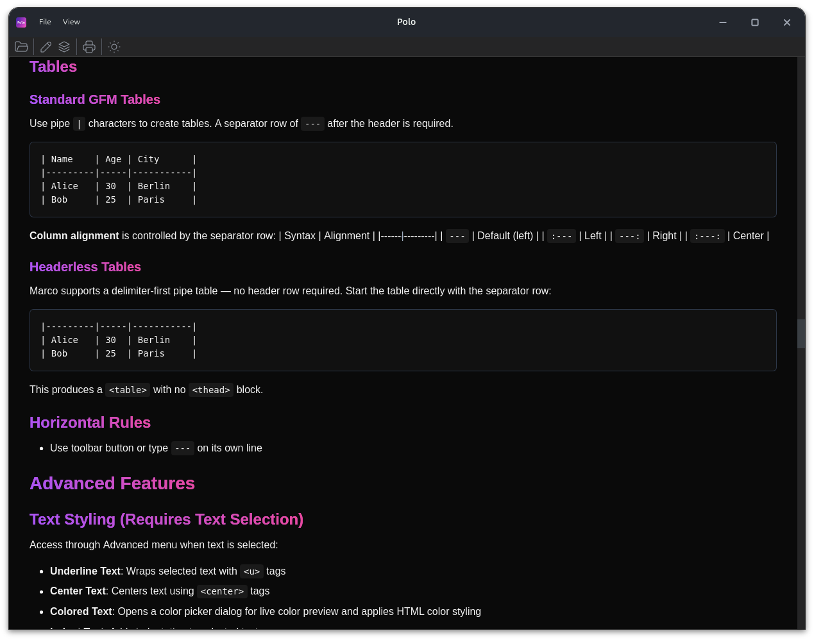

<p align="center">
  
</p>

<p align="center">
  
  
  
  
  
  
  
  <a href="https://crates.io/crates/marco-core"></a>
</p>

**Marco** is a fast, cross-platform Markdown editor built in Rust with live preview, syntax extensions, and a custom parser for technical documentation.

**Polo**, its companion viewer, lets you open and read Markdown documents with identical rendering and minimal resource use.  

Both run natively on **Linux and Windows**, built with **GTK4 and Rust**, designed for speed, clarity, and modern technical writing — with features like **executable code blocks**, **document navigation**, and **structured formatting**.

<p align="center">
  
  <br/>
  
  <br/>
  <em>Marco - Full-featured Markdown editor with live preview</em>
</p>

<p align="center">
  
  <br/>
  <em>Polo - Lightweight Markdown viewer</em>
</p>

<a href="documentation/Screenshot">View more screenshots</a>

## Quickstart

Ready to try Marco? Installation is simple and takes less than a minute:

| Linux | Windows |
|-------|---------|
| Download the latest `.deb` from the **Releases** page:<br>https://github.com/Ranrar/Marco/releases/latest | Download the latest `.zip` from the **Releases** page:<br>https://github.com/Ranrar/Marco/releases/latest |
| **Asset:** `marco-suite_<version>_linux_amd64.deb` | **Asset:** `marco-suite_<version>_windows_amd64.zip` |
| **Install (Debian/Ubuntu):**<br>1. Download the `*.deb` asset for your architecture (typically `amd64`)<br>2. Install with your package manager (e.g. `dpkg`), then resolve any missing dependencies if prompted | **Install:**<br>1. Download the `.zip` asset<br>2. Extract to any location (e.g., `C:\Program Files\Marco`)<br>3. Run `marco.exe` or `polo.exe`<br>4. Settings are stored in the extracted folder (portable mode) |

## Use the parser as a library

Marco's parser, AST, HTML renderer, and language-intelligence features are now published as a standalone crate on crates.io:

[](https://crates.io/crates/marco-core)

```toml
[dependencies]
marco-core = "1.0.2"
```

```rust
use marco_core::{parse, render, RenderOptions};

let doc = parse("# Hello\n\nThis is **Marco**.")?;
let html = render(&doc, &RenderOptions::default())?;
```

`marco-core` is pure Rust with no GTK dependencies, so it can be embedded in CLIs, build tools, and other editors. It is developed in its own repository ([Ranrar/marco-core](https://github.com/Ranrar/marco-core)) and versions independently from the Marco/Polo binaries.

## What can you use Marco & Polo for?

| Use Case | Marco (Editor) | Polo (Viewer) |
|---|:---:|:---:|
| Technical documentation & manuals | Yes | Yes |
| Research papers (math, footnotes, references) | Yes | Yes |
| Books & long-form writing | Yes | Yes |
| Presentations & slide decks | Yes | Yes |
| README & project documentation | Yes | Yes |
| Blog posts & articles | Yes | Yes |
| API documentation | Yes | Yes |
| Meeting notes & minutes | Yes | Yes |
| Knowledge base & personal wiki | Yes | Yes |
| Release notes & changelogs | Yes | Yes |
| Study notes & course material | Yes | Yes |

## Features at a glance

Marco aims for **100% CommonMark compliance** (currently 652/652 spec tests passing), plus a practical set of focused extensions.

| Feature | Status |
|---|---|
| CommonMark core (headings, lists, code, links, images, blockquotes…) | Yes |
| International text (Unicode) + RTL text direction support | Yes |
| Tables (GFM) including headerless tables | Yes |
| Task lists and inline checkboxes | Yes |
| Strikethrough, highlight, superscript, subscript | Yes |
| Footnotes and inline footnotes | Yes |
| Admonitions / callouts (Note, Warning, Tip, custom) | Yes |
| Emoji shortcodes (`:joy:`) | Yes |
| User mentions (`@name[platform]`) | Yes |
| Math — KaTeX inline and block | Yes |
| Mermaid diagrams | Yes |
| Tab blocks | Yes |
| Slide decks | Yes |
| Heading IDs for stable anchors | Yes |
| GFM autolink literals | Yes |
| PDF export | Yes |
| Print preview with page settings | Yes |
| Table of contents (TOC) sidebar | Yes |
| Bookmarks and cross-file links | Yes |
| Scroll sync between editor and preview | Yes |

## View modes

| Mode | Purpose | Status | Notes |
|---|---|---|---|
| Live Preview | Real-time rendered Markdown while you edit. | Available | Synced with editor, supports themes and interactive preview behaviors. |
| Print Preview | Paged, print-focused preview for PDF/export workflows. | Available | Uses paged media rules (paper size, orientation, margins, page numbers). |
| Code View | Inspect the underlying rendered HTML source. | Available | Useful for debugging markup/output structure. |
| Presentation View | Slide-style reading/presenting mode for documents and decks. | Planned | In progress for a future release. |

## Why Marco?

I started building Marco because I couldn't find a simple, reliable Markdown editor for Linux.  
As an IT systems manager, I've always preferred **local software** — fast, safe, and running entirely on my own machine, not in the cloud.  
In my daily work, I write a lot of **technical documentation and manuals**, so I needed a tool that could handle complex documents efficiently and reliably.

That idea became a personal challenge: to create a complete Markdown editor from the ground up — with a **custom-built parser** and a design focused on performance, clarity, and long-term potential.

---

Most Markdown editors focus on simplicity. Marco focuses on **precision**.

It's built for developers, engineers, and writers who need:
- **Native performance** — no login, no cloud, your documents stay on your machine
- **Structured documents** — full control over headings, blocks, and formatting  
- **Custom Markdown grammar** — hand-crafted parser for extensibility and AST-level control  
- **Seamless preview** — rendered with WebKit and perfectly synced with the editor  

Whether you're writing technical docs, tutorials, or long-form text, Marco turns Markdown into a professional writing tool — fast, clear, and extensible.

## Key technologies

- **GTK4-RS** (`gtk4`, `glib`, `gio`) - Cross-platform GUI toolkit powering windows, widgets, menus, and event handling.
  Used for Marco and Polo's native Linux/Windows interface.

- **SourceView5** (`sourceview5`) - Editor component with syntax highlighting and code-friendly text features.
  Powers the Markdown editing area (line numbers, search/replace, formatting aids).

- **WebKit6 / WebView2** - HTML preview engine (`webkit6` on Linux, `wry`/WebView2 on Windows).
  Renders live preview with local images, CSS themes, and scroll-sync interactions.

- **nom** (`nom`) - Parser combinator library used for Marco's custom Markdown grammar.
  Enables recursive-descent parsing and AST generation in the [`marco-core`](https://github.com/Ranrar/marco-core) crate.

- **RON** (`ron`) - Human-readable configuration format for settings, themes, and preferences.
  Easy to edit manually and friendly for version control.

- **KaTeX** (`katex-rs`) - Rust implementation of KaTeX for math rendering.
  Supports fast native inline and block LaTeX output without browser JS dependencies.

- **Mermaid** (`mermaid-rs-renderer` / `mmdr`) - Pure Rust renderer by [Jeremy Huang](https://github.com/1jehuang/mermaid-rs-renderer).
  Supports 23 diagram types and can be 100-1400x faster than `mermaid-cli`.

- **Paged.js** (`paged.js`) - CSS Paged Media polyfill used in print-preview pagination.
  Project: [pagedjs/pagedjs](https://github.com/pagedjs/pagedjs) (MIT License).

- **markdownlint** - Marco uses an internal diagnostics catalog aligned with markdownlint-style rule IDs (**MD***).
  Project: [DavidAnson/markdownlint](https://github.com/DavidAnson/markdownlint).

## Roadmap

### core Parser & Language Features
- [x] Syntax highlighting in editor (via intelligence engine)
- [x] Diagnostic underlines — issue detection with hover details and footer panel
- [x] Hover insights — Markdown element info and diagnostic details at cursor
- [ ] Completion (in-progress: Markdown completions available; refinement ongoing)
- [ ] Enhanced AST validation and error reporting
- [ ] Optimize parser performance and caching

### Editor Features (Marco)
- [x] Multiple layout modes: editor+preview, editor only, preview only, detachable preview
- [x] Scroll sync between editor and preview
- [x] Intelligent search
- [x] Context menus & toolbar: Quick access to formatting and actions
- [x] Syntax highlighting in editor
- [x] Diagnostics (issue underlines, footer panel, hover details, reference dialog)
- [x] Markdown hover insights
- [x] Right-to-left (RTL) text direction support with live toggle
- [x] Table auto-align — pipe tables reformatted on Tab/Enter/cursor-leave; manual via context menu or Ctrl+Alt+T
- [x] Tools menu — live toggles for wrap, line numbers, invisibles, tabs, syntax colours, table auto-align, scroll sync, and text direction
- [ ] Multi-cursor editing support
- [ ] LSP protocol for language server integration

### Viewer Features (Polo)
- [x] Same viewer engine as Marco
- [x] Local link prompt — click a `.md` link in the preview to open it in Polo
- [x] Document navigation: TOC sidebar (collapsible, click-to-scroll)
- [x] Native Windows and Linux Print option
- [ ] Search function
- [ ] Mouse over link information

### Document Features
- [x] Smart code blocks with programming languages syntax
- [x] Math rendering: KaTeX support for equations and formulas (inline `$...$` and display `$$...$$`)
- [x] Diagram support: Mermaid for flowcharts, sequence diagrams, class diagrams, and 20+ other diagram types
- [x] Export to PDF
- [x] Page size presets for export (A4, US Letter, etc.)
- [x] Document navigation: TOC sidebar (collapsible, click-to-scroll, configurable depth)
- [x] Document navigation: bookmarks
- [x] Document navigation: cross-file links (local link prompt in preview)
- [ ] Document presentation mode

### Advanced Features
- [x] Language plugin system via. `marco-shared/src/assets/language/xx*.toml` files
- [ ] Local AI-assisted tools: writing suggestions, grammar checking, content improvement
- [ ] Collaborative editing (Yjs/CRDT): shared document model, multi-cursor, presence awareness
- [ ] Built in terminal to run code blocks in editor

### Distribution & Platform
- [x] Cross-platform support: Linux and Windows builds
- [x] Linux packaging: .deb packages
- [x] Windows packaging: Portable .zip packages
- [ ] Additional packaging: Snap, .MSI installer

### Opt-in Telemetry
- [ ] Privacy-first telemetry (opt-in, disabled by default)
  - **Privacy guarantees**: No personal data, no file content, no tracking cookies
  - **User control**: First-run dialog, settings toggle, can be disabled anytime
  - **Data collected** (anonymous, minimal):
    - App launch events (to understand active user count)
    - OS type (Linux/Windows) and app version
    - Anonymous session ID (random UUID per session, not tied to user)
    - Feature usage patterns (which menu items, view modes, export formats)
    - Error/crash reports (stack traces only, no user content)
    - Timestamp and timezone offset
  - **Purpose**: Prioritize development on most-used features, fix critical bugs faster
  - **Transmission**: Lightweight HTTPS endpoint, 3-second timeout, non-blocking


## Contributing

We welcome contributions of all sizes. Short workflow:

1. Open an issue describing the change or bug you plan to address.
2. Fork the repository and create a feature branch.
3. Add tests where appropriate and keep changes small and focused.
4. Run `cargo build` and `cargo test` locally.
5. Open a pull request referencing the issue and describe the change.

Code style & expectations:

- Keep UI code in `marco/src/ui/` and shared, GTK-free application logic in `marco-shared/src/`. Pure parser/renderer logic lives in the external [`marco-core`](https://github.com/Ranrar/marco-core) crate.
- Follow Rust idioms (use `Result<T, E>`, avoid panics in library code).
- Add unit tests and integration tests in `tests/` when applicable.

### High-value contributions

If you'd like to make a high-impact contribution, consider one of these areas — open an issue first so we can coordinate:

- Collaborative editing (Yjs / CRDT): add a `marco/src/components/collab/` backend that implements a `CollabBackend` trait and provide in-process tests for concurrent patches and cursor sync.
- AI-assisted tools: add a `marco/src/components/ai/` interface for suggestions/edits; keep adapters off the UI thread and provide a small example implementation.

### Component docs & assets

Reference locations for contributors working on components and translations:

- [marco/src/components/ai/README.md](marco/src/components/ai/README.md) — AI component guidance and interface notes
- [marco/src/components/collab/README.md](marco/src/components/collab/README.md) — Collaboration integration notes and references
- [documentation/language.md](documentation/language.md) — Localization provider contract and workflow
- [marco-shared/src/assets/language/language_matrix.md](marco-shared/src/assets/language/language_matrix.md) — language implementation matrix

## AI-assisted development

This project is developed with occasional help from AI tools (for example, Copilot-style code suggestions). AI can speed up prototyping and refactors, but:

- Changes are still reviewed by a human.
- Tests and linting are expected to pass before merging.
- If something looks "too magical to be true", please open an issue — bugs don't get a free pass just because a robot wrote the first draft.
